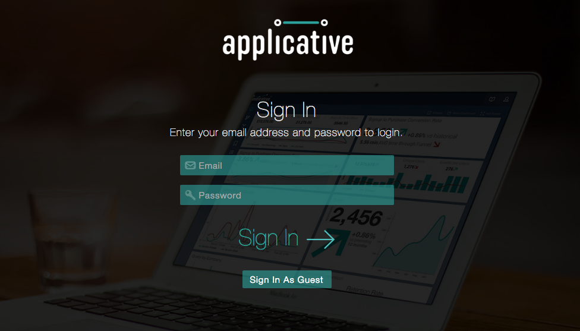
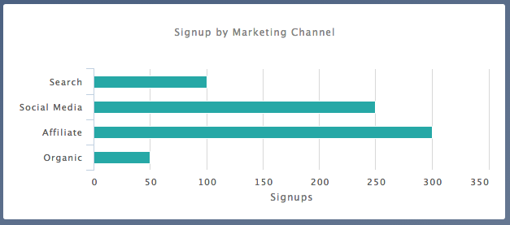
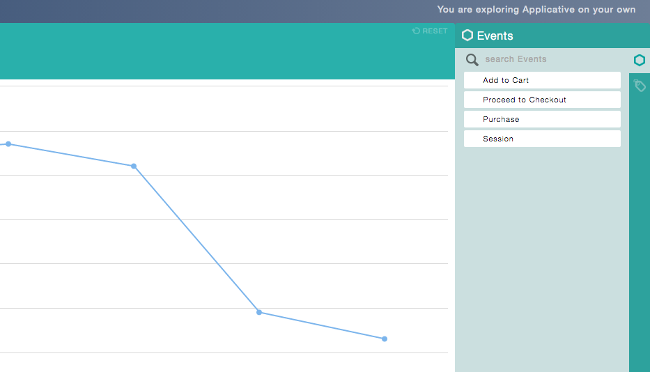

# Applicative

[https://applicative.herokuapp.com][heroku]

[heroku]: https://applicative.herokuapp.com

## Features and Implementation

Applicative is a web application inspired by Indicative built using Ruby on Rails and React.js.

Applicative displays customizable dashboard visualizations of user interactions. The app's
custom ORM segments consumer events by user demographics, A/B groups, etc, and integrates
React Drag-n-Drop with Highcharts.js for visualization interactivity. User engagement and
retention can be quantified at each stage of the purchase funnel, allowing issues to be
pinpointed and immediately addressed.

###Authentication

A single page application, Applicative supports new account creation and login, as well
as a guest/demo login feature. API calls to a Sessions Controller allow for sensitive user
information to remain on the back-end, while the root page renders content based on a call
to a Sessions Store on the front-end.

###Dashboard

Upon login, a call is made to a single Events Controller action, which constructs data and
options for each of the four Dashboard charts. The HighCharts.js options allow for a variety
of chart types, and users can interact with the chart legends as well as their layout on
the page.

###Segmentation

The Segmentation feature also utilizes a call to the Events Controller to populate its
HighCharts.js line chart using options from the request's query string. Users drag and drop
purchase events and user demographics into the chart, and the Events Controller uses custom
database queries in the Event model to return the appropriate chart options to the front-end.

Listening for changes to the Options Store, the Segmentation chart renders any updates made
by the user dragging and dropping the React.js components onto the chart area. Chart options can
continue to be added or removed with the query bar above the Segmentation Chart.

##Future Project Features

While the Dashboard and Segmentation features provide excellent insight into all aspects
of the purchase funnel, I plan to continue adding more features.

###Tags

Clicking specific data points within the Segmentation chart in order to tag other users
of the application will allow for efficient communication of key insights.

###Funnel

The Segmentation feature allows users to visually see drop offs within the purchase funnel,
and the Funnel Chart feature will take this functionality to the next level, providing a more
precise quantification of exactly what is going on at each stage of the funnel.
